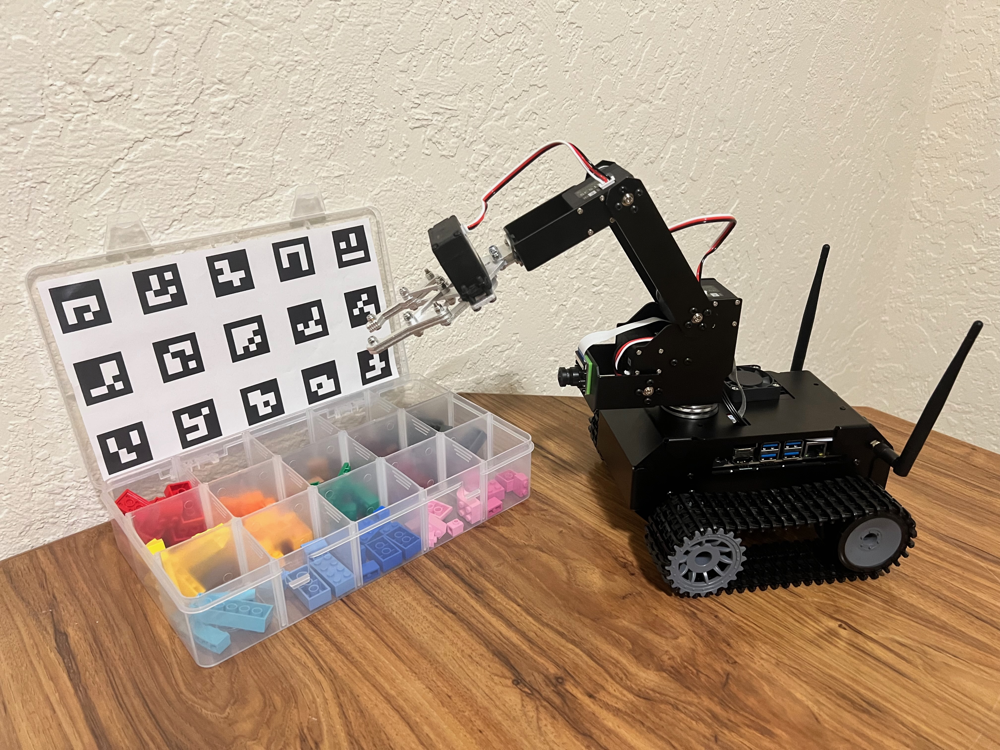
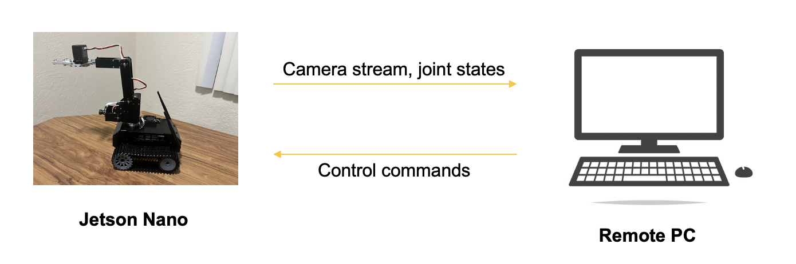
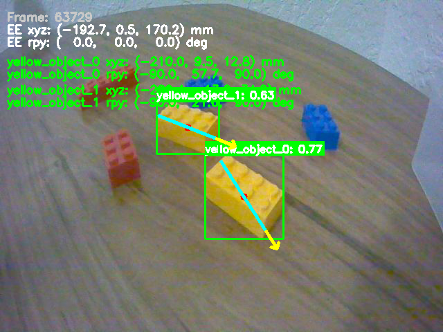
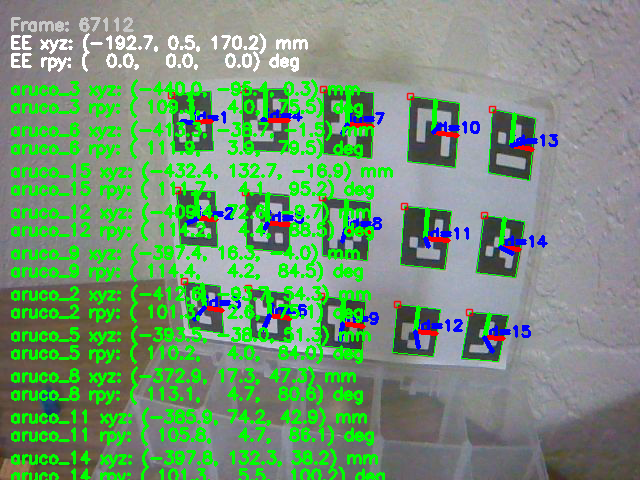

# RoboSort: Fog Computing Framework for Real-Time Robotic Perception and Control on Edge Devices



### Demo Video
[Watch RoboSort Demo Video](https://github.com/inbarajaldrin/MFG598_Robosort/raw/main/resources/robosort_demo.mp4)

## Preface

**Edge devices** like **Raspberry Pi**, **Jetson Nano**, **Arduino**, and **drones** have very little processing capabilities onboard, which makes the scope of mini projects using these devices close to impossible. Demonstrating algorithms like **YOLO**, **SLAM**, **RTAB-Map**, or even running open-source **LLMs** locally and in real-time becomes very difficult without a significant drop in **FPS**.

We propose a **communication protocol** that enables **global**, **low-latency** transfer of **ROS 2 data** using **VPN** and **WebRTC**, ensuring secure, real-time streaming of information from local robot to offload heavy processing to remote systems.

## System Requirements

### Jetson Nano Setup

The Jetson Nano base image uses only **Ubuntu 18**, and we use a **ROS 2 Docker** container inside this image to set everything up. The image to upload to the robot will be updated [insert link here].

## Architecture

The RoboSort system consists of four main layers:



| Layer | Components |
|-------|-----------|
| **Physical Device Layer** | JETANK 4-axis mobile robot controlled using A4500 |
| **Network Layer** | ROS2, VPN, MCP, and MQTT |
| **Cloud Layer** | MQTT Broker |
| **Analytics and Visualization Layer** | Tkinter dashboard with camera and database monitoring|

## Robot Control GUI


## Detection Visualization

<div style="display: flex; gap: 10px;">
  
  
</div>

## Setup Instructions

### Prerequisites

1. Clone this repository to your `Documents` folder:
   ```bash
   cd ~/Documents
   git clone <repository-url>
   cd MFG598_Robosort
   ```

2. Initialize and update submodules:
   ```bash
   git submodule update --init --recursive
   ```

### Step 1: DDS Configuration

Configure ROS 2 DDS to enable communication between the robot and remote PC:

1. **Install Tailscale** on both devices:
   ```bash
   curl -fsSL https://tailscale.com/install.sh | sh
   sudo tailscale up
   sudo tailscale status  # Note all Tailscale IPs
   ```

2. **Update CycloneDDS configuration**:
   - Navigate to `RoboSort/dds_config/`
   - Edit `cyclonedds.xml` with the Tailscale IPs of all devices you wish to connect

3. **Set environment variables** and add to `~/.bashrc`:
   ```bash
   export CYCLONEDDS_URI=file:///path/to/cyclonedds.xml
   export RMW_IMPLEMENTATION=rmw_cyclonedds_cpp
   export ROS_DOMAIN_ID=45  # Same on all machines
   ros2 daemon stop && ros2 daemon start
   ```

   Add these lines to your `~/.bashrc` to make them persistent.

### Step 2: ROS 2 Package Setup

#### On Jetson Nano (Docker Container)

1. **Hyperlink the ROS 2 packages**:
   - `jetank_control`
   - `JETANK_description`

2. **Build the ROS 2 workspace**:
   ```bash
   cd ~/ros2_ws
   colcon build
   source install/setup.bash
   ```

3. **Launch the robot description**:
   ```bash
   ros2 launch JETANK_description tkinter.launch.py
   ```

   You can verify if the robot moves by interacting with the GUI in real hardware mode.

4. **Start the camera stream**:
   ```bash
   python3 /path/to/mpeg_streamer_direct.py
   ```

   This publishes the stream to port **8081**, which can be viewed from the remote PC.

#### On Remote PC

1. **Hyperlink the ROS 2 package**:
   - `aruco_camera_localizer`

2. **Download the camera stream**:
   ```bash
   python3 ~/Documents/MFG598_Robosort/RoboSort/dds_config/http_stream_publisher.py
   ```

   This reads data from port 8081 and publishes it as a ROS 2 image topic (`/camera/image_rgb`).

3. **Verify the camera topic**:
   ```bash
   ros2 topic list  # Should see /camera/image_rgb
   ros2 topic echo /camera/image_rgb
   ```

4. **Build the ROS 2 workspace**:
   ```bash
   cd ~/ros2_ws
   colcon build
   source install/setup.bash
   ```

5. **Launch the ArUco camera localizer**:
   ```bash
   ros2 run aruco_camera_localizer localize --yoloe --aruco --drop --headless
   ```

   This will localize all objects and ArUco markers in the scene relative to the robotic arm's base to perform inverse kinematics.

6. **Launch the dashboard GUI**:
   - Update the ROS2 camera topics in `dashboard_gui/tkinter_gui.py` to match your camera topics:
     ```python
     TOPIC_1 = "/camera/image_rgb_exo"  # Update to your camera topic
     TOPIC_2 = "/camera_annotated"       # Update to your annotated camera topic
     ```
   - Then launch the dashboard:
     ```bash
     python3 ~/Documents/MFG598_Robosort/dashboard_gui/tkinter_gui.py
     ```

### Step 3: ROS MCP Server Setup

1. **Navigate to the ros-mcp-server directory**:
   ```bash
   cd ~/Documents/MFG598_Robosort/ros-mcp-server
   ```

2. **Sync dependencies using uv**:
   ```bash
   uv sync
   ```

3. **Add the ROS MCP server to your Claude Desktop config file**:
   ```bash
   code ~/.config/Claude/claude_desktop_config.json
   ```

4. **Add the following configuration**:
   ```json
   "ros-mcp-server": {
     "disabled": false,
     "timeout": 60,
     "type": "stdio",
     "command": "/path/to/ros-mcp-server/.venv/bin/python",
     "args": [
       "/path/to/ros-mcp-server/server.py"
     ]
   }
   ```

   Replace `/path/to/ros-mcp-server` with the actual path to your `ros-mcp-server` directory.

The ROS MCP server holds the primitives used to control the robot using an AI agent.

## Monitoring and Logging

The progress of the sorting operation is monitored using a **local SQLite database** that receives updates via **MQTT**. The **MQTT** broker is one of the tools the agent can call when it wants to log progress. The system provides real-time monitoring through the **Tkinter dashboard GUI** that displays:
- Two ROS2 camera streams 
- Real-time LEGO sorting records table
- MQTT connection status

## Usage

Once all components are set up and running:

1. Ensure the robot description GUI is running on the Jetson Nano
2. Start the camera stream on the Jetson Nano
3. Start the HTTP stream publisher on the remote PC
4. Launch the ArUco camera localizer on the remote PC
5. Launch the dashboard GUI on the remote PC
6. Use the ROS MCP server through Claude Desktop to control the robot via natural language commands

## Troubleshooting

- **DDS communication issues**: Ensure all devices have the same `ROS_DOMAIN_ID` and that Tailscale IPs are correctly configured in `cyclonedds.xml`
- **Camera stream not visible**: Verify that port 8081 is accessible and that the HTTP stream publisher is running
- **Package not found**: Ensure all ROS 2 workspaces are built and sourced correctly

